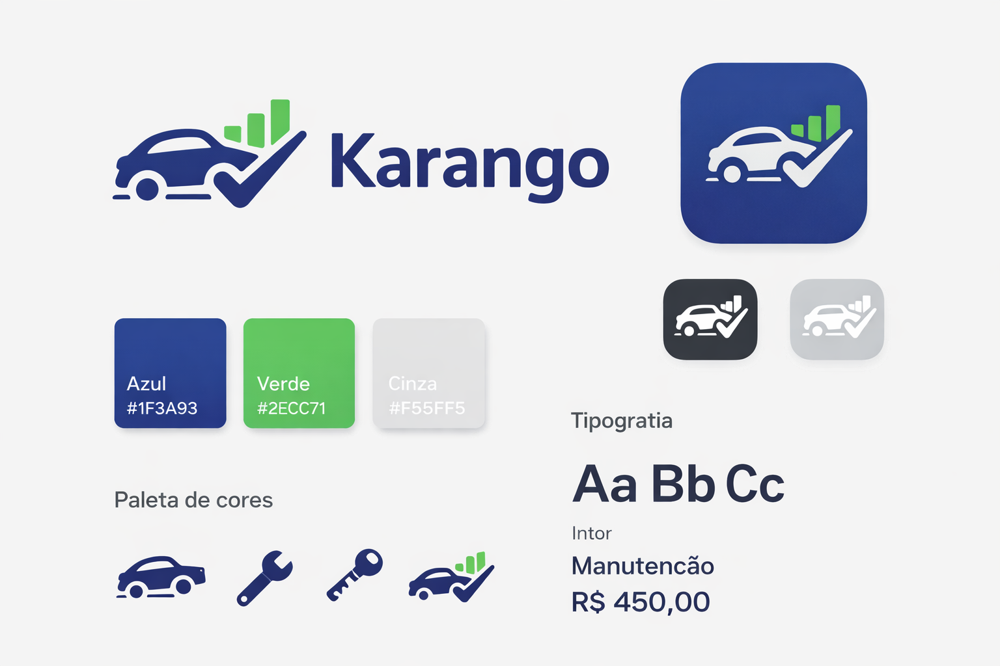

# Karango - Controle de Gastos e Manutenção de Veículos

**Karango** é um aplicativo moderno e clean para gerenciar gastos e manutenção de veículos pessoais. Ele ajuda o usuário a acompanhar despesas com combustível, manutenção e revisões, de forma simples e visualmente agradável.

---

## Identidade Visual

### Logotipo
O logotipo combina um **carro estilizado** com um **gráfico de barras e checkmark**, representando controle e gestão financeira de veículos.

- **Estilo:** Flat, minimalista, moderno
- **Tipografia:** Sans-serif (Inter)
- **Uso:** Branding, marketing e app

### App Icon
O ícone do app é derivado do logotipo principal, em **formato quadrado com cantos arredondados**, adequado para iOS e Android.

- Versão principal: Fundo azul escuro, carro branco, gráfico verde
- Versões alternativas: Monocromáticas (preto ou cinza claro)

---

## Paleta de Cores

| Cor       | Hex       | Uso                           |
|-----------|-----------|-------------------------------|
| Azul escuro | #1F3A93 | Títulos, headers             |
| Verde      | #2ECC71 | Indicadores positivos        |
| Cinza claro| #F5F5F5 | Fundo, neutro                |
| Preto      | #000000 | Textos principais            |

---

## Tipografia

- **Fonte:** Inter (sans-serif)
- **Pesos:** Regular para textos, Bold para títulos e valores
- **Tamanhos sugeridos:**
  - Títulos: 18–24pt
  - Texto normal: 14–16pt
  - Valores: 20–28pt

---

## Elementos Gráficos

- Ícones minimalistas de: carro, ferramenta, chave, gráfico de barras
- Linhas limpas e curvas suaves
- Microinterações: cores indicam status (verde positivo, laranja/vermelho alerta)

---

## Aplicação

Karango pode ser usado para:

- Registrar despesas de combustível e manutenção
- Acompanhar revisões futuras
- Ter uma visão clara do custo de posse de veículos
- Melhorar controle financeiro pessoal relacionado a veículos

---

## Exemplo Visual

---

**Desenvolvido para fornecer uma experiência moderna, intuitiva e confiável no gerenciamento de veículos pessoais.**
